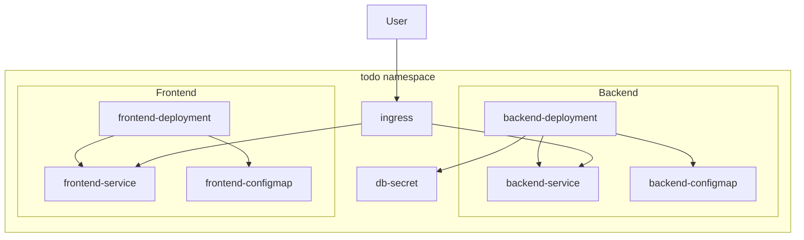

# Phase IV Data Model: Kubernetes Resources

**Feature**: 004-phase4-kubernetes
**Date**: 2025-12-28
**Status**: Complete

## Overview

Phase IV focuses on infrastructure-as-code rather than application data models. This document defines the Kubernetes resource entities that will be created and managed by Helm charts.

---

## 1. Kubernetes Resources

### 1.1 Namespace

| Field | Type | Description |
|-------|------|-------------|
| name | string | Resource namespace identifier |
| labels | map[string]string | Metadata labels for organization |

**Configuration**:
```yaml
name: todo
labels:
  app.kubernetes.io/name: todo
  app.kubernetes.io/version: "0.4.0"
  app.kubernetes.io/managed-by: helm
```

---

### 1.2 Deployment (Backend)

| Field | Type | Description |
|-------|------|-------------|
| name | string | Deployment identifier |
| replicas | integer | Number of pod replicas |
| image | string | Container image reference |
| containerPort | integer | Port exposed by container |
| resources.limits.memory | string | Max memory allocation |
| resources.limits.cpu | string | Max CPU allocation |
| resources.requests.memory | string | Requested memory |
| resources.requests.cpu | string | Requested CPU |
| livenessProbe | ProbeSpec | Health check configuration |
| readinessProbe | ProbeSpec | Readiness check configuration |
| env | []EnvVar | Environment variables |
| envFrom | []EnvFromSource | ConfigMap/Secret references |

**Relationships**:
- References: ConfigMap (backend-config)
- References: Secret (db-credentials)
- Exposes: Service (backend-service)

---

### 1.3 Deployment (Frontend)

| Field | Type | Description |
|-------|------|-------------|
| name | string | Deployment identifier |
| replicas | integer | Number of pod replicas |
| image | string | Container image reference |
| containerPort | integer | Port exposed by container (3000) |
| resources.limits.memory | string | Max memory allocation |
| resources.limits.cpu | string | Max CPU allocation |
| livenessProbe | ProbeSpec | Health check configuration |
| env | []EnvVar | Environment variables |
| envFrom | []EnvFromSource | ConfigMap references |

**Relationships**:
- References: ConfigMap (frontend-config)
- Exposes: Service (frontend-service)

---

### 1.4 Service

| Field | Type | Description |
|-------|------|-------------|
| name | string | Service identifier |
| type | string | Service type (ClusterIP) |
| port | integer | Service port |
| targetPort | integer | Container port to route to |
| selector | map[string]string | Pod label selector |

**Instances**:
- `backend-service`: Routes to backend pods on port 8000
- `frontend-service`: Routes to frontend pods on port 3000

---

### 1.5 Ingress

| Field | Type | Description |
|-------|------|-------------|
| name | string | Ingress identifier |
| host | string | Hostname for routing (e.g., todo.local) |
| paths | []PathSpec | URL path routing rules |
| annotations | map[string]string | Ingress controller annotations |

**Path Configuration**:
| Path | Service | Port | Description |
|------|---------|------|-------------|
| `/api/*` | backend-service | 8000 | API endpoints |
| `/chatkit` | backend-service | 8000 | ChatKit endpoint |
| `/mcp/*` | backend-service | 8000 | MCP server |
| `/` | frontend-service | 3000 | Frontend app |

---

### 1.6 ConfigMap

| Field | Type | Description |
|-------|------|-------------|
| name | string | ConfigMap identifier |
| data | map[string]string | Key-value configuration pairs |

**Instances**:

**backend-config**:
| Key | Description | Default |
|-----|-------------|---------|
| LOG_LEVEL | Application log level | INFO |
| CORS_ORIGINS | Allowed CORS origins | http://todo.local |
| API_PREFIX | API route prefix | /api |

**frontend-config**:
| Key | Description | Default |
|-----|-------------|---------|
| NEXT_PUBLIC_API_URL | Backend API URL | http://todo.local/api |

---

### 1.7 Secret

| Field | Type | Description |
|-------|------|-------------|
| name | string | Secret identifier |
| type | string | Secret type (Opaque) |
| data | map[string][]byte | Base64-encoded secret data |

**db-credentials**:
| Key | Description |
|-----|-------------|
| DATABASE_URL | PostgreSQL connection string |
| SECRET_KEY | JWT signing secret |
| OPENAI_API_KEY | OpenAI API key |

---

## 2. Helm Values Schema

### 2.1 Global Values

```yaml
# values.yaml schema
global:
  namespace: string              # Kubernetes namespace
  environment: string            # dev/staging/prod

backend:
  enabled: boolean              # Deploy backend
  replicas: integer             # Pod count
  image:
    repository: string          # Image name
    tag: string                 # Image tag
    pullPolicy: string          # Always/IfNotPresent/Never
  service:
    port: integer               # Service port
  resources:
    limits:
      memory: string
      cpu: string
    requests:
      memory: string
      cpu: string
  probes:
    liveness:
      path: string              # /health
      initialDelaySeconds: integer
      periodSeconds: integer
    readiness:
      path: string              # /ready
      initialDelaySeconds: integer
      periodSeconds: integer
  config:
    logLevel: string
    corsOrigins: string

frontend:
  enabled: boolean
  replicas: integer
  image:
    repository: string
    tag: string
    pullPolicy: string
  service:
    port: integer
  resources:
    limits:
      memory: string
      cpu: string
  config:
    apiUrl: string

ingress:
  enabled: boolean
  className: string             # nginx
  host: string                  # todo.local
  annotations: map[string]string

secrets:
  databaseUrl: string           # Base64 encoded
  secretKey: string             # Base64 encoded
  openaiApiKey: string          # Base64 encoded
```

---

## 3. Docker Image Specifications

### 3.1 Backend Image

| Attribute | Value |
|-----------|-------|
| Base Image | python:3.13-slim |
| Working Directory | /app |
| Exposed Port | 8000 |
| Entrypoint | uvicorn src.main:app |
| User | non-root (1000) |
| Expected Size | <500MB |

**Build Arguments**:
- None required (all config via environment)

**Labels**:
```dockerfile
LABEL org.opencontainers.image.title="Todo API"
LABEL org.opencontainers.image.version="0.4.0"
LABEL org.opencontainers.image.description="Phase IV Todo API"
```

---

### 3.2 Frontend Image

| Attribute | Value |
|-----------|-------|
| Base Image | node:20-alpine |
| Working Directory | /app |
| Exposed Port | 3000 |
| Entrypoint | node server.js |
| User | non-root (1001) |
| Expected Size | <200MB |

**Build Arguments**:
| Name | Description |
|------|-------------|
| NEXT_PUBLIC_API_URL | API URL for client-side requests |

**Labels**:
```dockerfile
LABEL org.opencontainers.image.title="Todo Frontend"
LABEL org.opencontainers.image.version="0.4.0"
LABEL org.opencontainers.image.description="Phase IV Todo Frontend"
```

---

## 4. Health Check Endpoints

### 4.1 Backend Endpoints

| Endpoint | Type | Response | Description |
|----------|------|----------|-------------|
| GET /health | Liveness | `{"status": "healthy"}` | Process is running |
| GET /ready | Readiness | `{"status": "ready"}` | DB connection verified |

**Readiness Logic**:
```python
async def readiness_check():
    """Check database connectivity."""
    try:
        async with engine.connect() as conn:
            await conn.execute(text("SELECT 1"))
        return {"status": "ready", "database": "connected"}
    except Exception as e:
        raise HTTPException(
            status_code=503,
            detail={"status": "not_ready", "database": str(e)}
        )
```

### 4.2 Frontend Endpoints

| Endpoint | Type | Response | Description |
|----------|------|----------|-------------|
| GET /api/health | Liveness | `{"status": "ok"}` | Next.js server running |

---

## 5. Resource Relationships



---

## 6. Validation Rules

### 6.1 Deployment Validation

| Rule | Constraint |
|------|------------|
| Replicas | >= 1 |
| Memory Limit | >= 64Mi |
| CPU Limit | >= 50m |
| Image Tag | Required, non-empty |
| Container Port | 1-65535 |

### 6.2 ConfigMap Validation

| Rule | Constraint |
|------|------------|
| LOG_LEVEL | One of: DEBUG, INFO, WARNING, ERROR |
| CORS_ORIGINS | Valid URL format |

### 6.3 Secret Validation

| Rule | Constraint |
|------|------------|
| DATABASE_URL | Valid PostgreSQL connection string |
| SECRET_KEY | Minimum 32 characters |
| OPENAI_API_KEY | Starts with "sk-" |

---

## 7. State Transitions

### 7.1 Pod Lifecycle

```
Pending → Running → Succeeded/Failed
    ↓
ContainerCreating
    ↓
Ready (readiness probe passes)
    ↓
Terminating → Terminated
```

### 7.2 Deployment Rollout

```
Deployment Created
    ↓
ReplicaSet Created
    ↓
Pods Scheduled
    ↓
Pods Running + Ready
    ↓
Deployment Available
```

### 7.3 Upgrade Flow

```
New Image Tag
    ↓
Helm Upgrade
    ↓
New ReplicaSet Created
    ↓
New Pods Start
    ↓
Old Pods Terminate (after new ready)
    ↓
Rollout Complete
```
